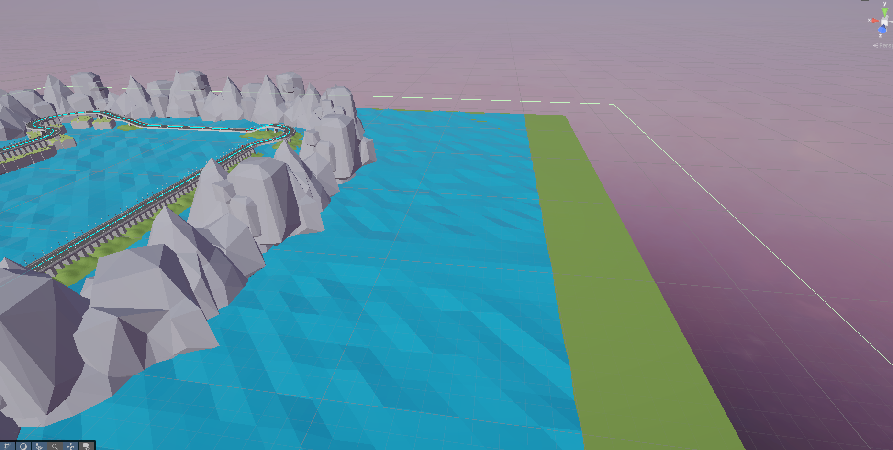

KillPlane выполняет роль невидимой страховочной сетки под трассой. Обычно объект с этим компонентом размещают значительно ниже уровня дорожного полотна и увеличивают до размеров, покрывающих всю зону возможного падения машины. Атрибут RequireComponent гарантирует наличие Collider, а в методе Reset скрипт автоматически переключает его в режим isTrigger. Это позволяет любым частям автомобиля свободно “пролетать” через плоскость без столкновений, но при этом даёт возможность отреагировать на событие OnTriggerEnter и перехватить машину ещё до того, как она начнёт бесконечно падать в пустоту. :contentReference[oaicite:2]{index=2}

При входе любого коллайдера в триггер KillPlane первым делом пытается найти LapTracker среди родительских объектов попавшего Collider. В идеальной конфигурации у машины есть общий корневой коллайдер, поэтому трекер обнаруживается сразу, и скрипт может немедленно вызвать RespawnToLastCheckpoint, вернув машину к последнему корректно пройденному чекпоинту. Однако в реальных проектах часто используются дополнительные коллайдеры: отдельные колёса, элементы подвески или декоративные части кузова, которые могут иметь собственный Rigidbody. Чтобы такие случаи тоже отрабатывались правильно, KillPlane после первой попытки берет attachedRigidbody у коллайдера, поднимается к корневому объекту этого тела и ищет LapTracker уже там.

Сам KillPlane не хранит никакой информации о круге, позиции машины на трассе или накопленных временах. Он полностью делегирует эти обязанности LapTracker, ограничиваясь простым “сигналом бедствия”: как только что-то, относящееся к машине, пересекает защитную плоскость, компонент просит трекер вернуть автомобиль в последнюю безопасную точку. Такой подход делает логику отказоустойчивости легко переиспользуемой: одна и та же KillPlane может обслуживать как машину игрока, так и ботов, не зная ничего о том, кто именно оказался внизу.

На практике KillPlane помогает решать сразу несколько задач. Во-первых, он не даёт автомобилю улететь слишком далеко от сцены и тем самым защищает игру от нестабильных физических состояний, когда значения координат и скоростей становятся чрезмерно большими. Во-вторых, он экономит время игрока: вместо того чтобы наблюдать за долгим падением или пытаться как-то выбраться наверх, пользователь почти мгновенно возвращается на трассу. И наконец, KillPlane полезен в отладке — визуальный гизмос плоскости, настроенный через стандартные средства редактора, наглядно показывает, где именно находится "точка невозврата" и не оставляет шансов случайно забыть про этот защитный слой на новой трассе.

