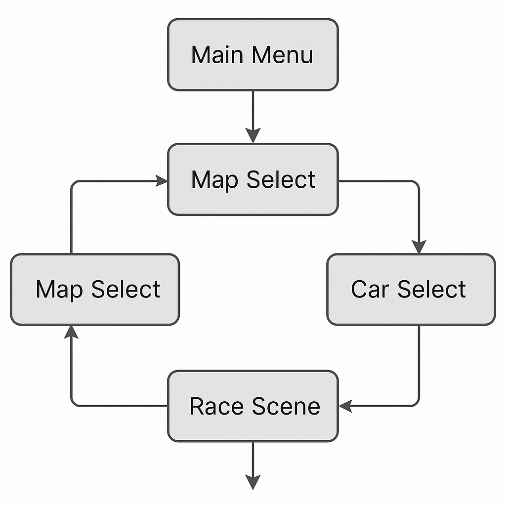

GameSession представляет собой глобальную “сессию игрока”, которая живёт между сценами и хранит выбор автомобиля, трассы и количества кругов. Компонент реализует паттерн синглтона через статическое свойство Instance и создаётся заранее благодаря методу Bootstrap, помеченному атрибутом RuntimeInitializeOnLoadMethod с типом BeforeSceneLoad. В этом методе в ранней фазе загрузки приложения создаётся новый GameObject, на который добавляется GameSession, а затем этот объект помечается DontDestroyOnLoad, чтобы не уничтожаться при смене сцен. В Awake скрипт следит за тем, чтобы в проекте всегда существовал только один экземпляр: если какая-то другая сцена случайно создаёт дубль, он тут же уничтожается, а ссылка Instance остаётся у исходного объекта. :contentReference[oaicite:4]{index=4}

С точки зрения игрового потока, GameSession используется двумя основными экранами: выбором карты и выбором машины. На экране MapSelect при клике по конкретной трассе вызывается метод ChooseTrack, который запоминает переданный TrackSpec, а также по его полю defaultLaps вычисляет исходное значение количества кругов SelectedLaps, подставляя безопасный минимум, если в ресурсе трассы ничего не указано. Позже, на экране CarSelect, UI вызывает BeginSoloRace, передавая выбранный CarSpec. В этом методе GameSession проверяет, что трасса действительно выбрана и у автомобиля есть валидный prefab; затем записывает этот CarSpec в SelectedCar и инициирует загрузку сцены трассы через SceneManager.LoadScene, используя имя сцены, хранящееся в TrackSpec. Таким образом, для запуска одиночной гонки достаточно выбрать карту и машину, а вся остальная информация автоматически доходит до сцены с RaceManager.

За счёт того, что GameSession помечен DontDestroyOnLoad, любой код в игровых сценах может безопасно обращаться к GameSession.Instance. RaceManager, загруженный внутри гонки, извлекает из сессии SelectedCar и SelectedLaps и не должен знать ничего о том, каким именно образом игрок делал выбор в меню. Другие системы, такие как статистика, сохранения или настройки управления, могут быть реализованы как дополнительные поля и методы в GameSession, оставаясь доступными во всех сценах без лишних глобальных переменных или статических классов-обёрток.

Важной деталью является метод GoTo, который упрощает переходы между сценами. Вместо того чтобы в разных местах проекта напрямую вызывать SceneManager.LoadScene с произвольной строкой, код может централизованно пользоваться GameSession.GoTo и при необходимости дополнить эту точку логикой сброса состояния, сохранения прогресса или смены профиля игрока. Это особенно удобно на экранах завершения гонки и в глобальном меню, где всегда требуется одинаковое поведение при переходе назад в главное меню или вперёд к следующей трассе.

